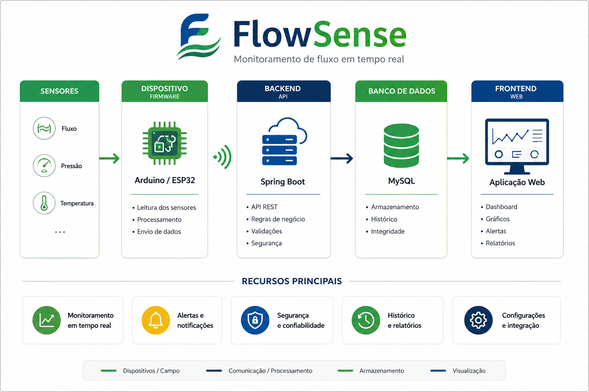

# FlowSense

Sistema de monitoramento de fluxo utilizando IoT, backend e frontend.



## Arquitetura

```text
Sensores
   ↓
Arduino / ESP32
   ↓
Spring Boot API
   ↓
Banco de Dados
   ↓
Frontend
```

## Estrutura

```text
Flow-Sense-Monitor/
├── flowsense-backend/    # Spring Boot
├── flowsense-frontend/   # Aplicação Web
├── flowsense-firmware/   # Arduino / ESP32
└── .gitmodules
```

Os módulos são repositórios independentes integrados através de **Git Submodules**.

## Tecnologias

- Java / Spring Boot
- Arduino / ESP32
- PlatformIO
- Banco de dados
- Docker
- Git / GitHub

## Clonar

```bash
git clone --recurse-submodules https://github.com/eduardofernandez197/Flow-Sense-Monitor.git
```

Caso já tenha clonado:

```bash
git submodule update --init --recursive
```

## Status

🚧 Projeto em desenvolvimento.